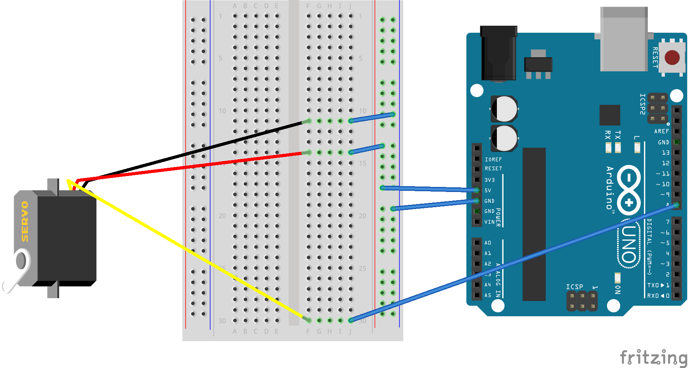

# celebrate-bot

This is a small project originally built for a blog post demonstrating how to integrate a fairly extensible platform to call an API to interact with the physical world.

Even though this project ends up performing a trivial action, the same architecture could be used to achieve almost any physical world integration.

## About the project

celebrate-bot has been built as a [Nobel](http://www.norbertoherz.com/nobel/) project. You can clone this repository, or build it yourself based one this simple [Swagger](https://swagger.io/) definition:
```
swagger: "2.0"
info:
  version: "0.0.1"
  title: CelebrateBot
paths:
  /celebrate:
    post:
      description: |
        Rises a flag in sign of celebration!
      responses:
        200:
          description: Successful response

```

Check ```bot/C_handlers.ino``` and ```bot/D_initialization.ino``` if you choose to build it yourself.

## Schema



Attach a handcrafted flag to the Servo and voila!
